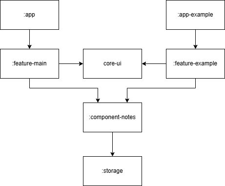

# TodoList – Showcase Project

## 📘 Overview

This project was initially planned to be a simple note-taking application inspired by the default notes app found on most smartphones (hence the name TodoList). However, after spending a lot of time on robust and scalable architecture, I've decided to turn this project into a full-scale task-managing application. Additionally I'm planning to add budgeting module for personal finances managment and transition this app to KMP and Compose Multiplatform so it could be released both on Android and iOs.

While its features are (so far) minimal by design, the architecture is deliberately more complex to showcase my skills as a developer. This includes practices and design patterns that would typically be considered over-engineering for an app of this size but serve to highlight capabilities in modular architecture, clean code, and modern Android development.


## 🛠 Tech Stack

- **Kotlin** – with Coroutines and Flows
- **Jetpack Compose**
- **Koin**
- **Room**

## 📚 Project Structure



```
:app               → Base application module
:app-example       → Demo app showcasing a simplified version of architecture and navigation
:core-ui           → Shared UI components (navigation, design system, etc.)
:feature-main      → Main feature module for viewing, creating, and editing notes
:feature-example   → Sample feature used in :app-example
:component_notes   → Business logic for notes management
:storage           → Data storage layer (currently using Room)
```

Modules documentation
- [:component-notes](docs/component_notes.md)

Here you can read more about some technical aspects of this app:
- [Modularization](docs/modularization.md)
- [Navigation](docs/navigation.md)
- [Gradle Convention Plugins](docs/convention_plugins.md)

## 🎯 Current Goals (2 weeks)

- 🔍 **Search** – Quickly find notes by keywords
- 🗂 **Folders** – Organize notes into custom categories

## 🧩 Upcoming Features (2 months)

- 🧩 **Transition to KMP and Compose Multiplatform**
- 🖼 **Rich Notes** – Support for text, images, media files, etc.
- ⏰ **Reminders** – Add alarms or time-based notifications

## 🌟 Potential Enhancements

- 📒 **Projects** - Uniting Notes into Projects with goals, milestones and deadlines
- 🔐 **Authentication & Sync** – Firebase integration for login and cloud storage
- 💵 **Budgeting module** – Potential module for personal expenses assessment
- 🧠 **More Tools** – Calendar, prioritization, and more

---

## 🤝 Contributing

At this time, the project is in an early development phase and not open for external contributions. However, feedback and suggestions are always welcome!

## 📄 License

[MIT License](./LICENSE) – feel free to use or adapt the codebase for your own projects.

## 🙋‍♂️ Author

Developed with ❤️ by Telma Evelina Popova
