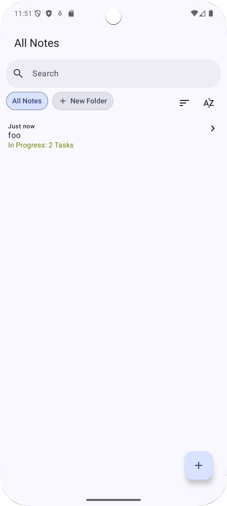
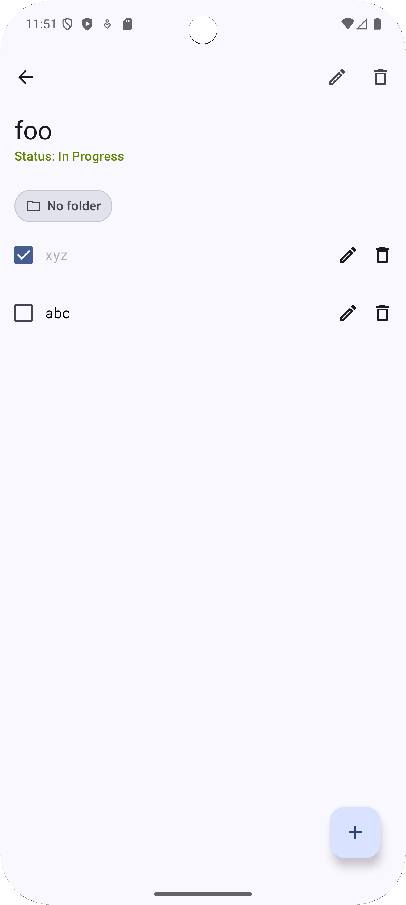

# TodoList – Showcase Project

## 📘 Overview

This project was initially planned to be a simple note-taking application inspired by the default notes app found on most smartphones (hence the name TodoList). However, after spending a lot of time on robust and scalable architecture, I've decided to turn this project into a personal showcase project to demonstrate my skills in Jetpack Compose, Android architecture and Agentic AI.

While its features are minimal by design, the architecture is deliberately more complex to showcase my architectural skills. This includes practices and design patterns that would typically be considered over-engineering for an app of this size but serve to highlight capabilities in modular architecture, clean code, and modern Android development.

## Features
- ✅ **Notes management**: create notes, read, update and delete
- 🔍 **Search**: find notes by keywords
- 🗂 **Folders**: organize notes into custom categories

## 🛠 Tech Stack

- **Kotlin** – with Coroutines and Flows
- **Jetpack Compose**
- **Koin**
- **Room**
- **Codex** for agentic AI

## 📚 Project Structure
```
:app               → Base application module
:core-ui           → Shared UI components (navigation, design system, etc.)
:feature-main      → Main feature module for viewing, creating, and editing notes
:component-notes   → Business logic for notes management
:storage           → Data storage layer (currently using Room)
```

## Documentation

Modules documentation
- [:component-notes](docs/component_notes.md)

Here you can read more about some technical aspects of this app:
- [Modularization](docs/modularization.md)
- [Navigation](docs/navigation.md)
- [Gradle Convention Plugins](docs/convention_plugins.md)

Here you can read more about the usage of Agentic AI in this project
- [Agentic AI setup](docs/ai.md)

Here you can read more about some of the project's business features
- [Search](docs/search_flow.md)
- [Folders](docs/folders_feature.md)

## Screenshots





---

## 🤝 Contributing

At this time, the project is not open for external contributions. However, feedback and suggestions are always welcome!

## 🙋‍♂️ Author

Developed with ❤️ by Telma Popova
